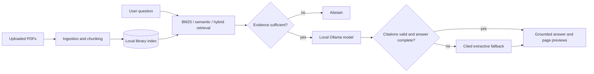

# Architecture

Paper Copilot is a local retrieval-augmented generation application. Streamlit owns the user session and presentation; modules in `src/` handle ingestion, retrieval, evidence checks, citations, and Ollama access.

## Components

- `app.py` coordinates uploads, indexing, search, answer generation, and the Streamlit interface.
- `src/ingest.py` extracts page text with PyMuPDF, cleans PDF hyphenation, and creates sentence-aware chunks that never cross page boundaries.
- `src/index.py` builds and loads BM25 and embedding indexes. Hybrid search uses reciprocal rank fusion, then suppresses near-duplicates and improves page diversity.
- `src/evidence.py` rejects weak evidence, checks identifiers, and enforces support from multiple documents for comparisons.
- `src/citations.py` validates evidence IDs and converts them into document/page citations.
- `src/llm.py` calls Ollama's local chat API.
- `src/config.py` centralizes runtime defaults and environment overrides.

## Stored data

Each ingested PDF produces page-bounded chunks and an index under `outputs/`. A combined library index keeps the source document and page on every chunk. Generated indexes and PDFs are intentionally ignored by Git.

## Answer path

The app retrieves a larger candidate set for comparisons and detailed methods. It selects a small evidence set for the prompt, checks sufficiency before calling Ollama, validates returned evidence IDs, and checks methodology completeness where relevant. A failed check produces a deterministic extractive answer with trusted page citations.
